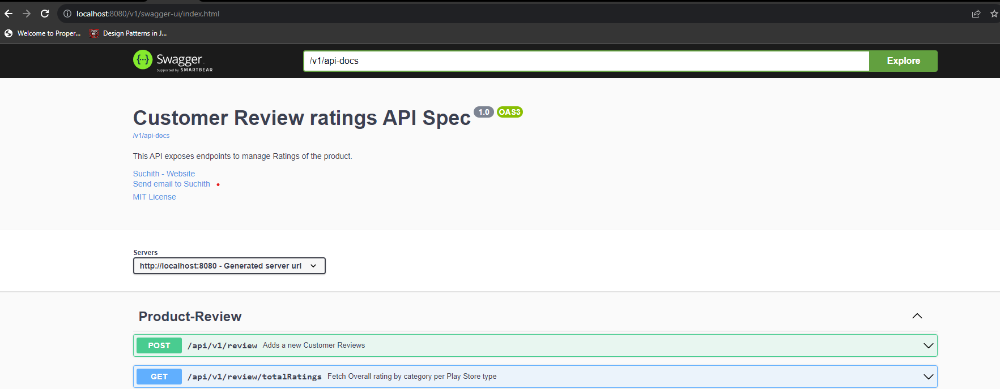
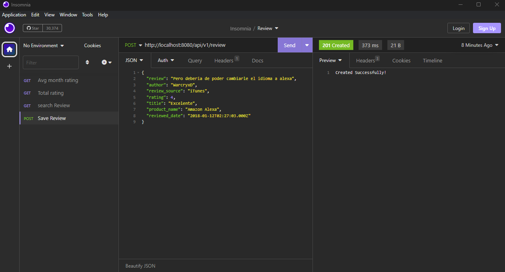
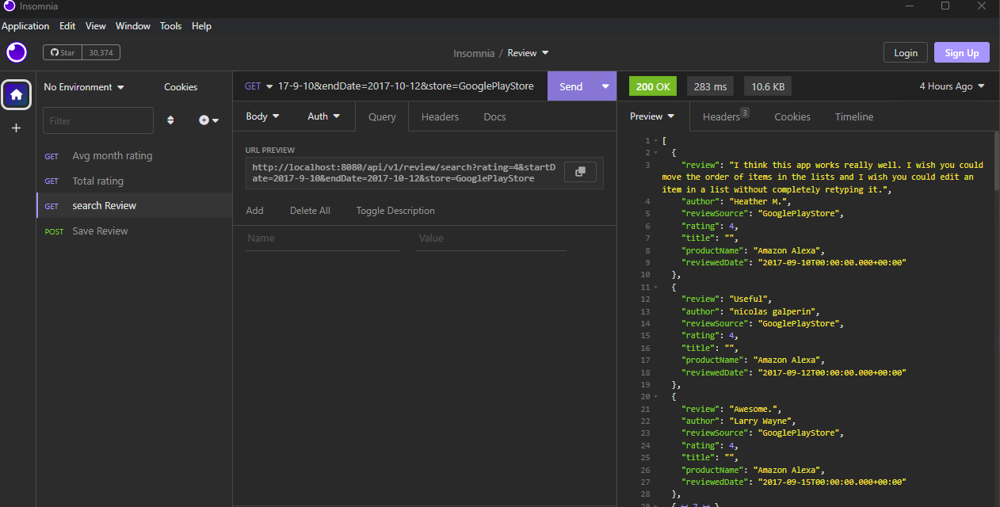
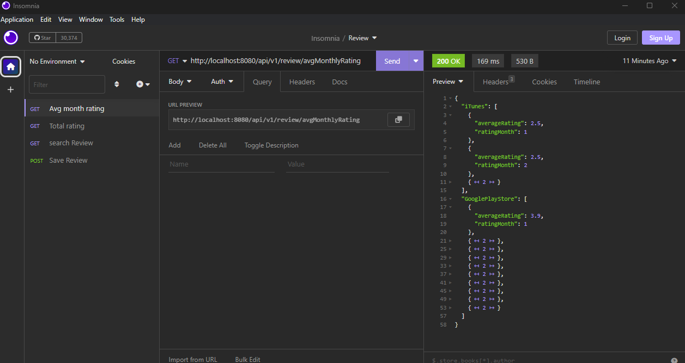
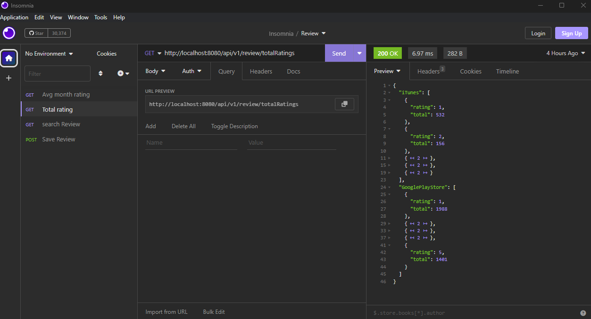
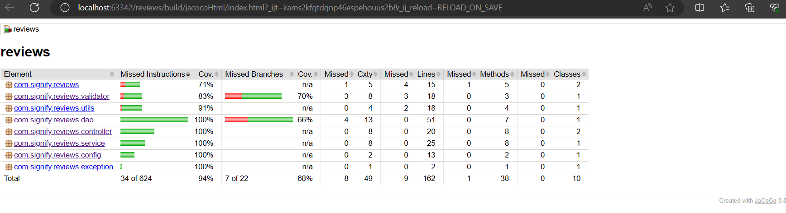

# Product Review Service App

## Requirements

For building and running the application:
- [JDK 1.8](http://www.oracle.com/technetwork/java/javase/downloads/jdk8-downloads-2133151.html)
- [Gradle 8.2.1](https://services.gradle.org/distributions/gradle-8.2.1-bin.zip)

## Running the application locally

```shell
.\gradlew clean build
.\gradlew bootRun
```

## Open API spec

it can be accessed locally after starting application at http://localhost:8080/v1/swagger-ui/index.html



## API request examples

1. Add review

-------------------------------------------
2. Search Review by filters
   
-------------------------------------------
3. Average Monthly rating per play store
   
-------------------------------------------
4. Total rating per play store by category wise
   

## Code coverage
after the jar build compeletion, it will be available under the jacocoHtml 
